# 城市财政缺口分析总结报告

## 概述
本报告总结了从城市房地产开发和销售角度分析财政缺口占GDP比的地区差异和时序特征的探索性数据分析结果。通过整合财政数据和房地产数据，进行数据合并、EDA、gap计算、地区分析、时序分析、相关性分析和可视化。

## 1. 探索性数据分析 (EDA)

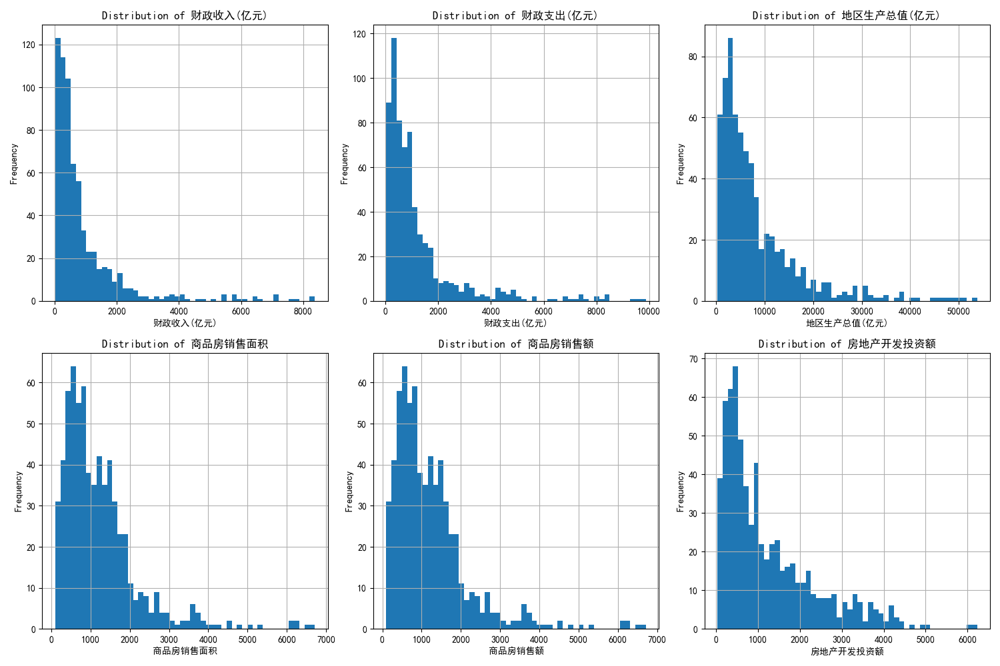
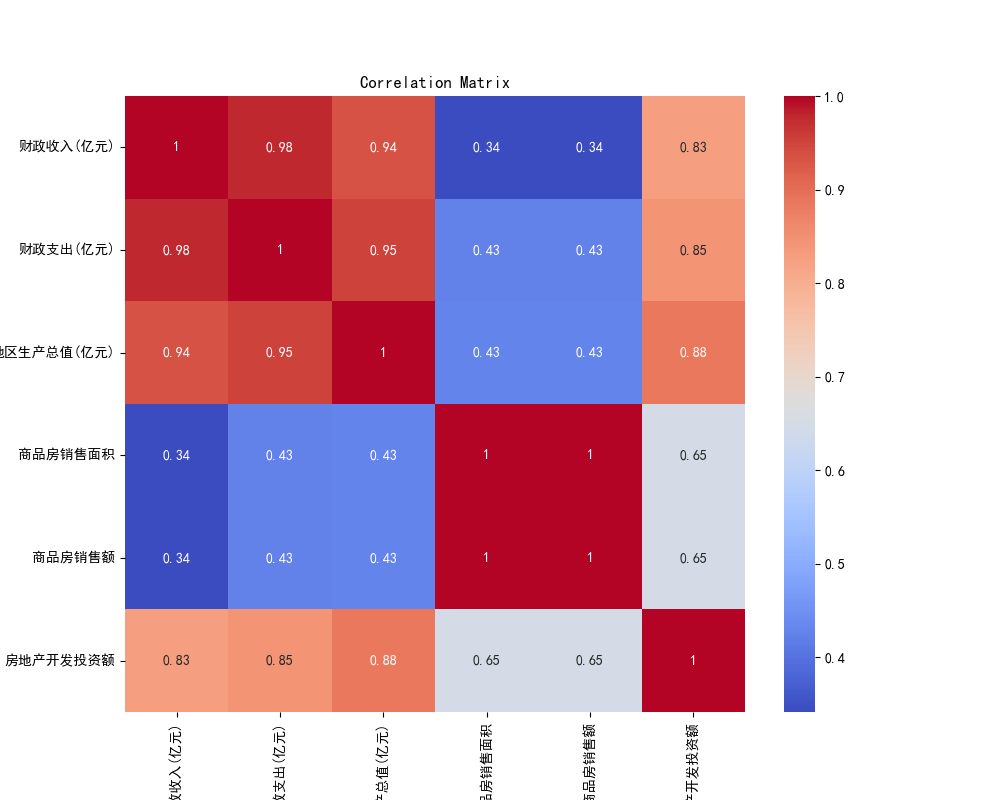

### 总结分析
关键变量分布显示财政和房地产数据存在较大差异，财政收入与支出高度相关。相关性矩阵表明房地产指标间相关性较强，但与财政变量相关性中等。

## 2. 计算财政缺口占GDP比

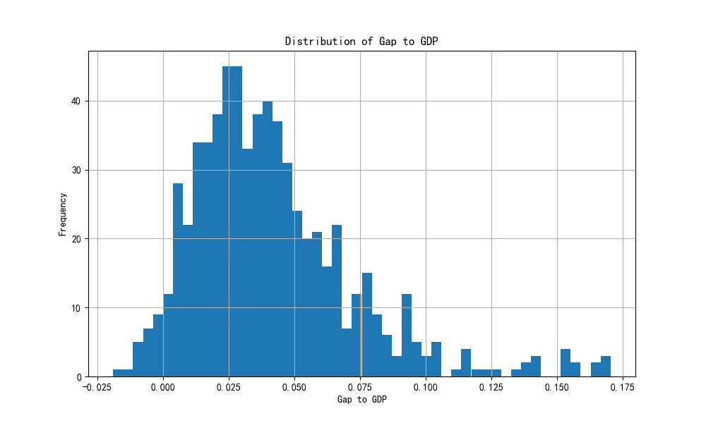

### 总结分析
财政缺口占GDP比例分布显示多数城市存在缺口，平均值为正，反映普遍财政压力。分布偏右，少数城市缺口较大。

## 3. 地区分析

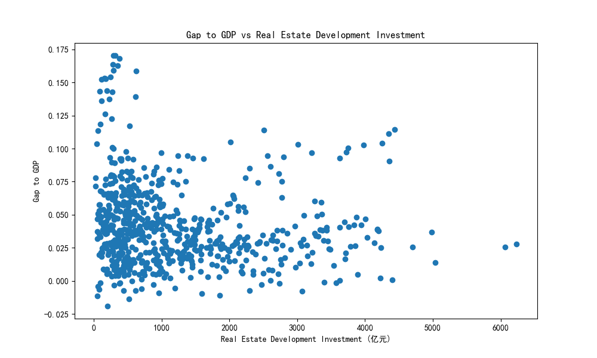
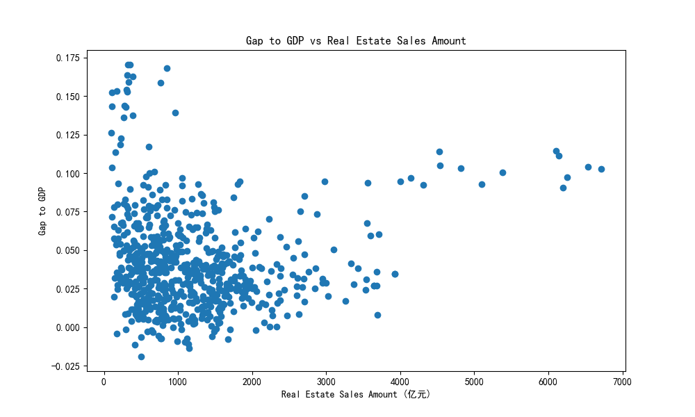

### 总结分析
不同城市财政缺口占GDP比差异明显，与房地产投资呈弱负相关，销售相关性极弱。表明房地产不是唯一影响财政缺口的因素。

## 4. 时序分析

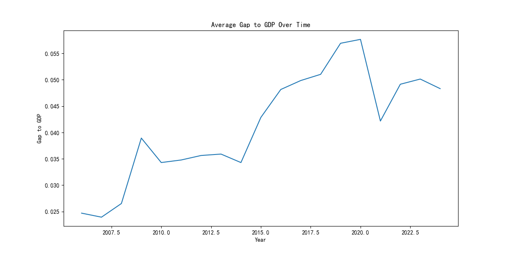
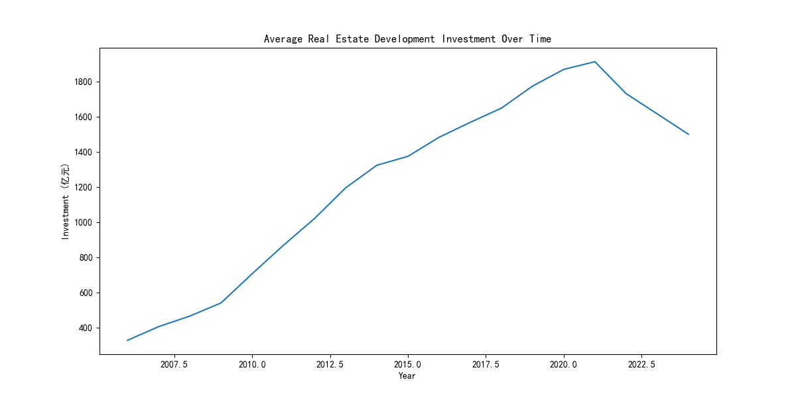
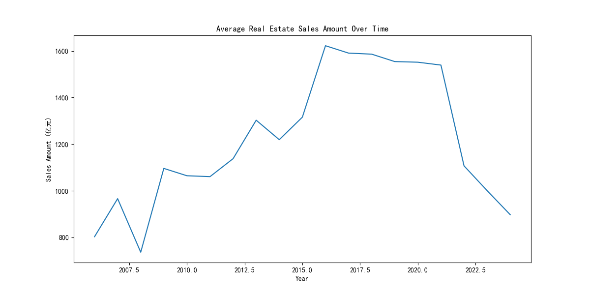

### 总结分析
财政缺口占GDP比随时间波动上升，与房地产指标在2016-2020年同步高峰，2021年后回落。显示房地产周期与财政变化的联动。

## 5. 相关性分析

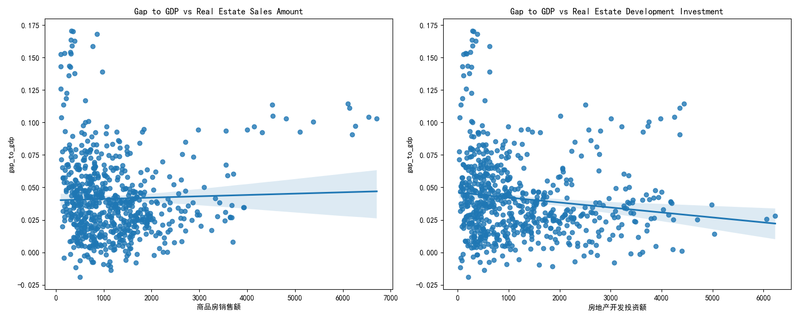

### 总结分析
财政缺口占GDP比与房地产销售额几乎无相关，与投资呈弱负相关。房地产内部相关性强，但对财政影响有限。

## 6. 发现可视化

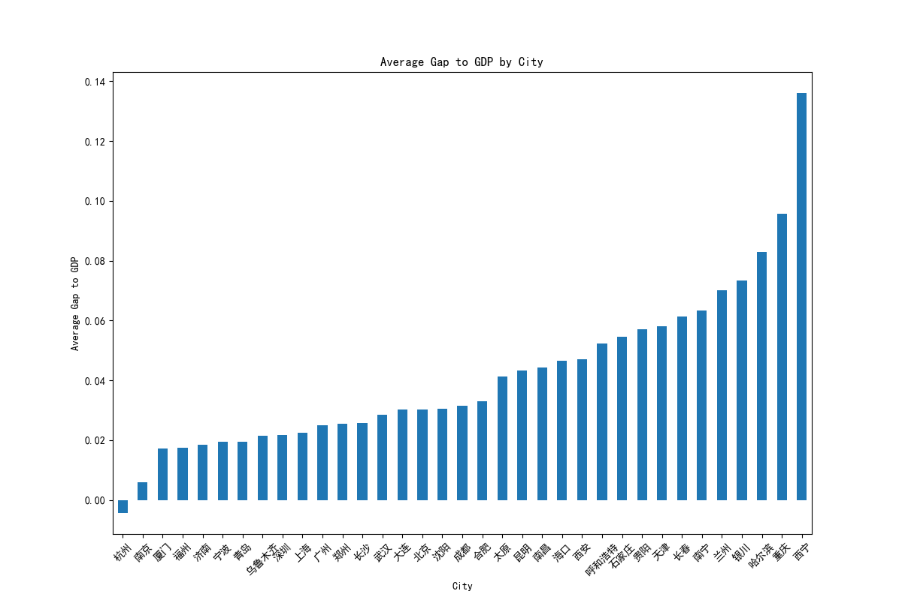
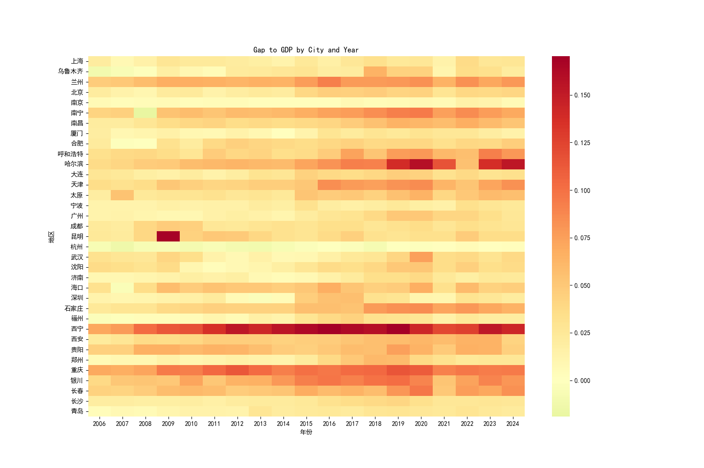
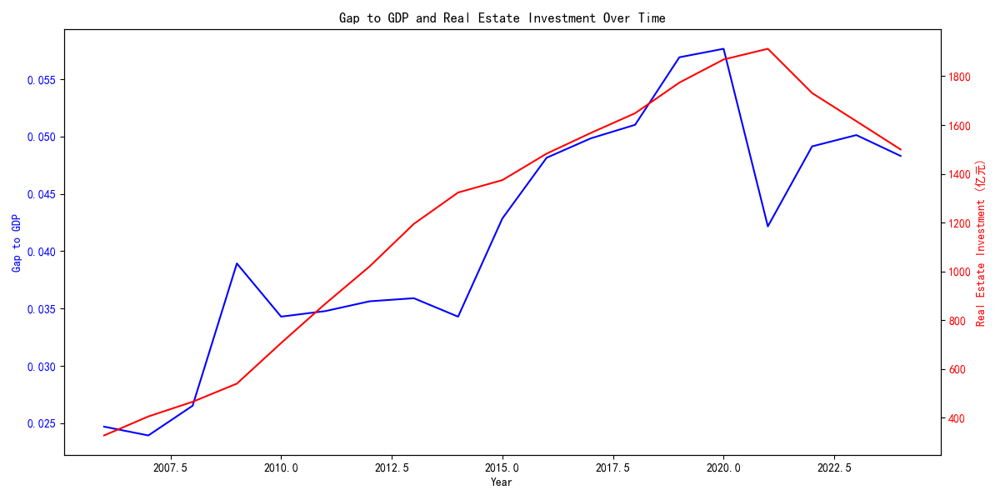

### 总结分析
城市间财政缺口占GDP比差异显著，热力图显示时空变化，双轴图确认房地产与财政的同步趋势。房地产对财政有一定影响但非决定性。

## 综合结论

- 财政缺口占GDP比在样本城市中普遍为正，说明地方财政支出压力显著存在。
- 房地产开发投资与财政缺口占GDP比存在弱负相关，表明房地产增长并不自动缓解财政缺口，要关注结构性和政策性因素。
- 区域差异明显：一线城市与珠三角、长三角表现不同，需实施差异化财政调控与债务管理策略。
- 时间趋势显示2016-2020年为gap高点，后疫情时期有所回落但仍处高位，需要持续关注人口、产业与土地财政关系的中长期演化。