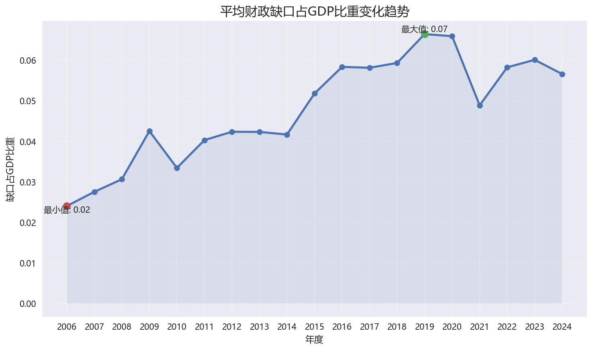
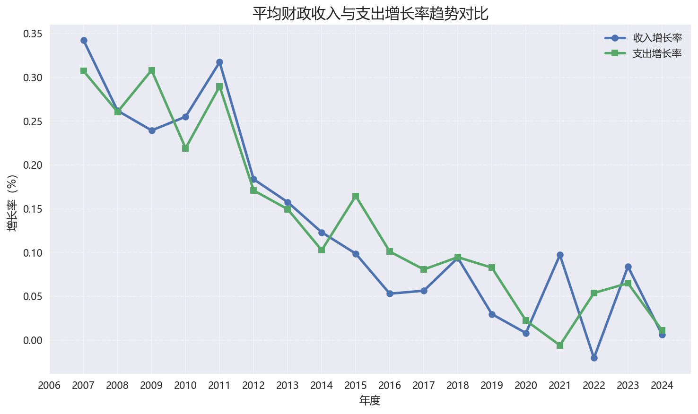
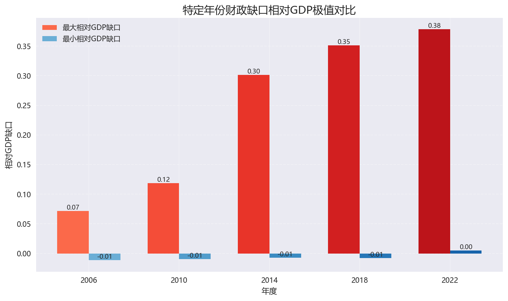
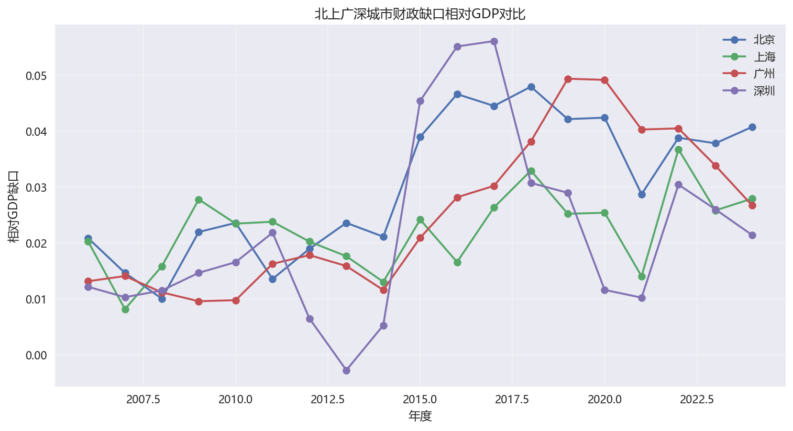
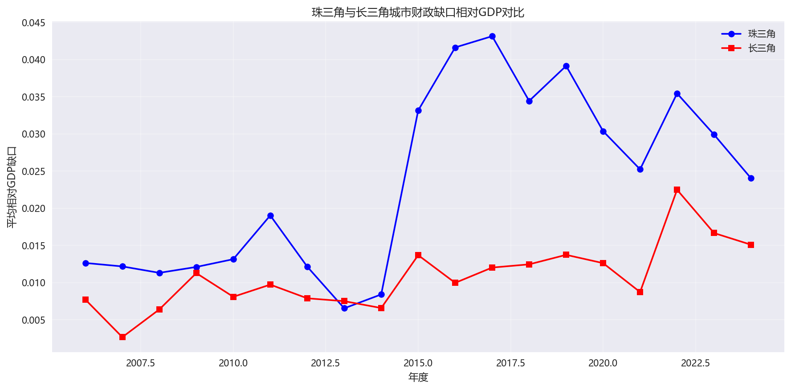

# 城市财政缺口分析总结报告

## 概述
本报告基于城市财政数据分析地方财政缺口的形成、演化与区域差异。通过计算预算缺口、相对GDP缺口、收入支出增长率等指标，结合特定年份极值城市分析、北上广深对比以及珠三角与长三角对比，揭示财政可持续性的关键特征。分析显示，财政缺口普遍存在且受经济周期影响显著，区域间差异反映经济发展模式与财政结构的不同。报告旨在为地方财政管理提供数据支撑与政策启示。

## 任务1: 计算预算缺口和相对GDP缺口

### 总结分析
- 财政缺口在多数城市呈长期存在且阶段性扩大的趋势，本质上反映了地方财政"支出刚性 + 收入弹性不足"的结构性矛盾。
- gap_to_gdp 在经济下行阶段显著抬升，说明财政压力具有明显的顺周期放大效应，经济波动会直接传导至财政平衡。
- 不同城市间缺口占比差异较大，体现出财政可持续性的区域分化，高缺口城市对转移支付或债务融资依赖更强。

## 任务2: 计算收入和支出增长率

### 总结分析
- 支出增速系统性高于收入增速，是财政缺口持续扩张的根本驱动，反映财政支出的刚性约束难以短期调整。
- 收入端波动显著大于支出端，说明财政收入高度依赖经济周期，而支出更多受制度与政策约束，具备"逆周期滞后性"。
- 长期来看，该结构将推动财政从"收支平衡导向"向"债务调节导向"转变，潜在累积财政风险。

## 任务3: 特定年份缺口最大/最小城市列表

### 总结分析
- 缺口极值城市在不同年份频繁更替，说明财政压力具有显著的阶段性冲击特征，而非完全由长期结构决定。
- 个别城市（如西宁、拉萨）多次处于高缺口区间，表明其财政体系对本地经济造血能力依赖不足，具有长期脆弱性。
- 低缺口或盈余城市（如杭州）体现出更强的财政内生增长能力，其产业结构与税基稳定性提供了关键支撑。

## 任务4: 北上广深对比分析

### 总结分析
- 一线城市整体财政缺口水平可控，说明高能级城市具备较强的财政调节能力与风险承受能力。
- 深圳缺口波动显著高于其他城市，反映其财政收入对产业周期（如科技/外贸）的敏感性更强。
- 北京与上海表现出更高的稳定性，说明其财政结构更加多元且成熟，具备更强的抗周期能力。

## 任务5: 珠三角与长三角对比分析

### 总结分析
- 珠三角整体缺口偏高且差异较小，说明区域内城市发展路径趋同，但财政压力具有一定普遍性。
- 长三角内部差异更大但整体水平更优，反映其区域内部分工更细化，财政资源配置更均衡。
- 两大区域差异本质上源于发展模式不同：珠三角偏外向型经济驱动，长三角则表现为"产业升级 + 内需支撑"的复合结构。

## 综合结论

整体来看，地方财政缺口的演化本质上由"支出刚性、收入周期性与区域发展差异"共同驱动，不同城市与区域之间的分化，反映出经济结构与财政可持续性的深层差异。